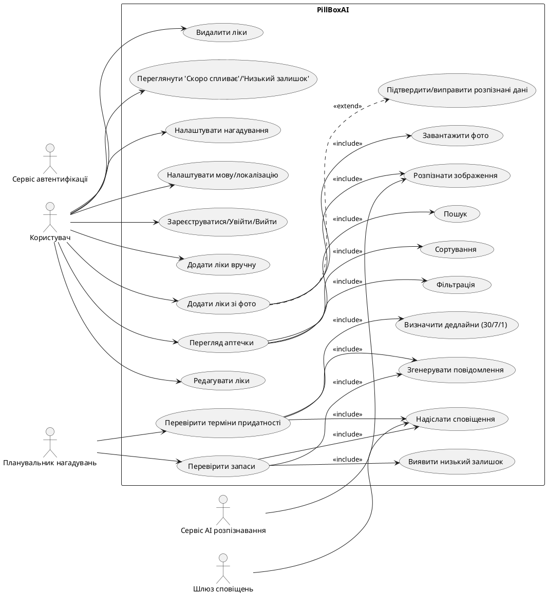

# 💊 PillBoxAI - Вимоги до системи

## Огляд проекту
PillBoxAI - це веб-додаток для обліку домашньої аптечки з автоматизацією та нагадуваннями, який допомагає користувачам зберігати порядок у ліках, відстежувати терміни придатності та попереджати про закінчення запасів.

---

## Функціональні вимоги

### Управління ліками
Система повинна надавати можливість користувачам додавати, редагувати та видаляти інформацію про препарати в їх домашній аптечці, включаючи назву, дозування, термін придатності, кількість та опис.

### Пошук та фільтрація
Система повинна забезпечувати швидкий пошук ліків за назвою, активною речовиною або ключовими словами з можливістю фільтрації за категоріями та термінами придатності.

### Система нагадувань
Система повинна автоматично відправляти користувачам нагадування про ліки, термін придатності яких добігає кінця (за 30, 7 та 1 день до закінчення), та про необхідність поповнення запасів.

### Авторизація та аутентифікація
Система повинна забезпечувати безпечну реєстрацію та авторизацію користувачів з персональними кабінетами, використовуючи JWT токени для аутентифікації.

### AI розпізнавання
Система повинна використовувати штучний інтелект для розпізнавання інформації з фотографій упаковок ліків та автоматичного внесення даних у базу (назва, дозування, термін придатності).

---

## Нефункціональні вимоги

### Сумісність
Система повинна коректно працювати в сучасних веб-браузерах (Chrome, Firefox, Safari, Edge) та бути адаптивною для мобільних пристроїв.

### Продуктивність
Система повинна забезпечувати час відгуку не більше 5 секунд для основних операцій (пошук, додавання ліків) та не більше 15 секунд для AI розпізнавання фотографій.

### Точність AI розпізнавання
Система повинна забезпечувати точність розпізнавання назв ліків з фотографій не менше 95% для чітких зображень та не менше 85% для зображень середньої якості. Помилкове розпізнавання критично важливої інформації (назва, дозування) не повинно перевищувати 2%.

### Локалізація та мультимовність
Система повинна підтримувати українську, англійську та польську мови з можливістю розпізнавання назв ліків на цих мовах. Інтерфейс повинен автоматично адаптуватися до локальних стандартів дат, часу та медичних термінів.

### Безпека
Система повинна забезпечувати шифрування всіх персональних даних користувачів, безпечне зберігання паролів (хешування) та захист від основних веб-атак (SQL injection, XSS, CSRF).

---

## User Stories

- Як користувач, я хочу швидко знаходити та фільтрувати ліки за назвою, діючою речовиною та терміном придатності, щоб швидко знаходити потрібний препарат.

- Як користувач, я хочу отримувати автоматичні нагадування за 30, 7 та 1 день до закінчення терміну придатності або низького залишку, щоб вчасно замінити або поповнити ліки.

- Як користувач, я хочу зробити фото упаковки ліків і щоб система автоматично розпізнавала назву, дозування та термін придатності, щоб швидко додавати препарат у мою аптечку.

## Use Case Diagram

