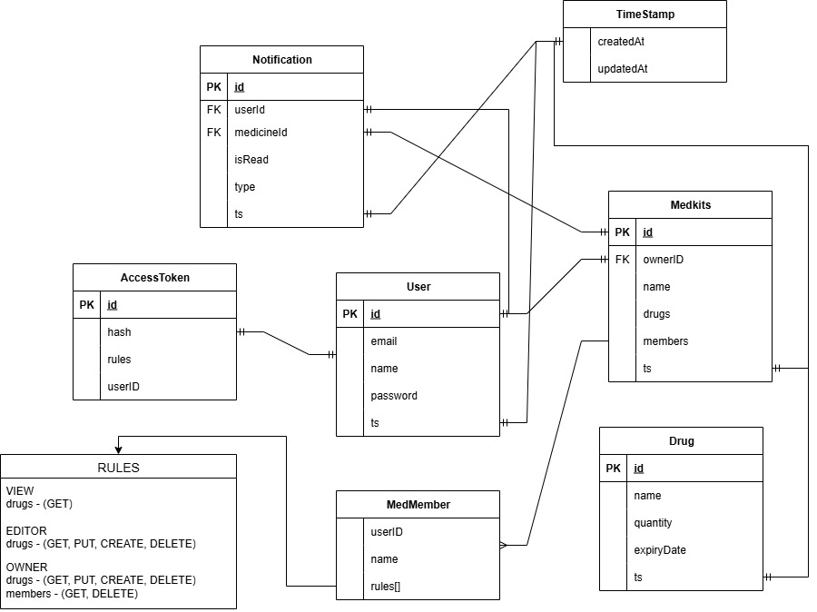

## Сутності та зв’язки

Опис сутностей і зв’язків із [ER-діаграми](shema.jpg), з полями у стилі **TypeScript інтерфейсів**.



---

### **User (Користувач)**

```ts
interface User {
  id: string; // PK
  email: string;
  name: string;
  password: string;
  ts: TimeStamp;
}
```

- Володіє кількома `Medkits`.
- Має кілька `AccessTokens`.
- Отримує `Notifications`.
- Може бути `MedMember` у чужих аптечках.

---

### **AccessToken (Токен доступу)**

```ts
interface AccessToken {
  id: string; // PK
  hash: string;
  rules: string;
  userID: string; // FK -> User
}
```

- Належить конкретному `User`.
- Визначає права доступу через `Rules`.

---

### **Medkit (Аптечка)**

```ts
interface Medkit {
  id: string; // PK
  ownerID: string; // FK -> User
  name: string;
  medicines: Medicines[];
  members: MedMember[];
  ts: TimeStamp;
}
```

- Належить певному `User`.
- Містить список `Medicines`.
- Може мати кількох `MedMembers`.

---

### **MedMember (Учасник аптечки)**

```ts
interface MedMember {
  userID: string;
  name: string;
  rules: string[];
}
```

- Представляє користувача в аптечці.
- Визначає права доступу (ролі).

---

### **Medicines (Ліки)**

```ts
interface Medicines {
  id: string; // PK
  name: string;
  quantity: number;
  expiryDate: Date;
  ts: TimeStamp;
}
```

- Належить певній аптечці (`Medkit`).
- Може бути використаний у `Notifications`.

---

### **Notification (Сповіщення)**

```ts
interface Notification {
  id: string; // PK
  userId: string; // FK -> User
  medicineId: string; // FK -> Medicines
  isRead: boolean;
  type: string;
  ts: TimeStamp;
}
```

- Повідомляє `User` про конкретні `Medicines` (наприклад, прострочені ліки чи низький залишок).

---

### **TimeStamp (Часова мітка)**

```ts
interface TimeStamp {
  createdAt: Date;
  updatedAt: Date;
}
```

- Використовується для відстеження створення та оновлення записів.

---

### **Rules (Правила доступу)**

```ts
enum Rules {
  VIEW = "medicines:GET",
  EDITOR = "medicines:GET,PUT,CREATE,DELETE",
  OWNER = "medicines:GET,PUT,CREATE,DELETE; members:GET,DELETE",
}
```

---

## Зв’язки

- **User – Medkit**: один користувач може мати багато аптечок.
- **User – AccessToken**: один користувач може мати кілька токенів доступу.
- **Medkit – Medicines**: одна аптечка може містити багато ліків.
- **Medkit – MedMember – User**: зв’язок багато-до-багатьох (користувач може бути учасником кількох аптечок).
- **User – Notification – Medicines**: сповіщення пов’язують користувача з конкретними ліками.
